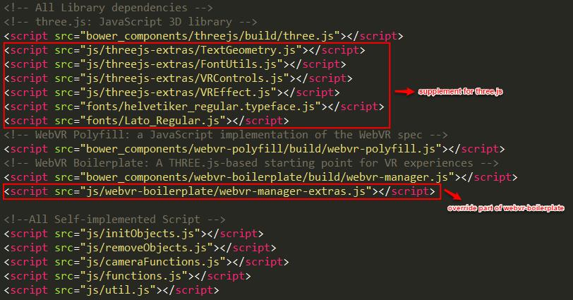

# vrv
#HOW TO RUN#
put all the files on a local or remote Apache server, use any webkit browser to access the index.php under the root directory.

#PROJECT STRUCTURE#
- animation: for future use and experiments, contain all those animation model files
- audio: where all the audio files like .mp3 files are
- bower_components: 
  - where all dependent packages and library files are, including threejs, webvr-polyfill.js, webvr-boilerplate.
  - additional dependent packages include howler.js(audio wrapper), tween.js(animation helper).
  - all necessary files are in folders named "build" in each of the package or library folder.
  - **DO NOT INCLUDE ANYTHING OUTSIDE THE "BUILD" FOLDERS, BECAUSE THOSE ARE JUST NON-DISTRIBUTED SOURCE FILES OF OPEN-SOURCED PROJECTS. IF YOU DO NEED TO MAKE USE OF THEM, COPY TO "js" FOLDER OF OUR VRV PROJECT ROOT DIRECTORY.**
  - **DO NOT MODIFY ANYTHING HERE BECAUSE THEY'RE ALL MANAGED BY BOWER.**
- data: where all configuration files and data files are, following the design principle of data and code separation.
- fonts: where all font files are for three.js so far.
- img: where all pictures are.
- js: where self-implemented script files are.
- test: put all unfinished test files here until everything has been done.
- video: all video file are here.
- .gitignore: git repo file, indicating what files are not going to be commited.
- bower.json: bower configuration file, containing library dependency information of our project.

#LIBRARY AND PACKAGE DEPENDENCY#
- our project is dependent on threejs and webvr-boilerplate.
- webvr-boilerplate is dependent on threejs, webvr-polyfill and promise-polyfill(we won't need this part).
- so the include order should be threejs->webvr-polyfill->webvr-boilerplate.

